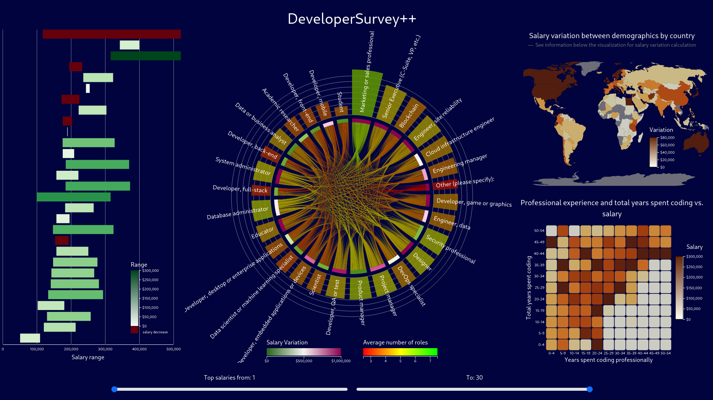

# DeveloperSurvey++



This is a data visualization project based on the StackOverflow developer survey. Using d3.js and a CSV file of the results, I studied the data and designed a dashboard with four charts. The visualization aims to compare data between developers from different demographics using the results from the 2022 survey.

The visualization focuses on comparing the salary of developers across years of experience, role, country, gender, and ethnicity. It reacts to user input, and highlights roles, countries, and salaries, with tooltips providing more information when relevant.

## Setup

This visualization is made using simple JavaScript (i.e. without Node.js), so the setup is fairly simple.

1. Download the dataset.

    I couldn't find a license describing how the data can be used, but to be safe I've excluded it from the repo. All of the previous surveys and results can be found on [StackOverflow's website](https://insights.stackoverflow.com/survey). This code was written around the 2022 results using the "Download Full Data Set (CSV)" link.
2. Extract and rename the CSV file.

    The CSV link on the dataset website actually points to a zip file, which includes some more information about the dataset. Extract `survey_results_public.csv` from the zip file and rename it to `stackoverflow_developer_survey_2022.csv`.

    If you use Linux or WSL, these two steps can be done using the command below in a shell:

    ```bash
    wget https://info.stackoverflowsolutions.com/rs/719-EMH-566/images/stack-overflow-developer-survey-2022.zip && unzip -p stack-overflow-developer-survey-2022.zip survey_results_public.csv > stackoverflow_developer_survey_2022.csv
    ```

3. Start a HTTP(S) server in the repo directory.

    Since the visualization has an external dependency on d3.js, you will get a nasty error in some browsers about an insecure CORS request. You can avoid this by setting up a HTTP server. I used Python to do this:

    ```bash
    $ python -m http.server

    Serving HTTP on 0.0.0.0 port 8000 (http://0.0.0.0:8000/) ...
    ```

    Once you've set that up, you can open the server and navigate to the `visualization.html` file.